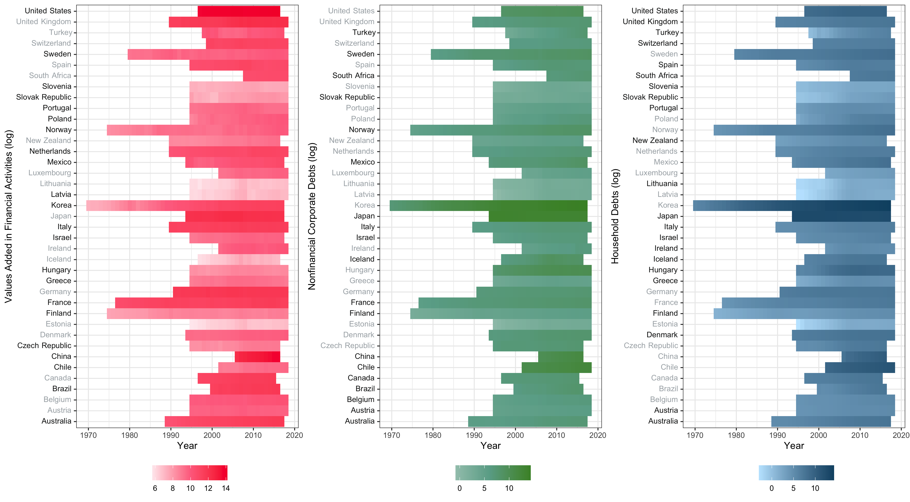
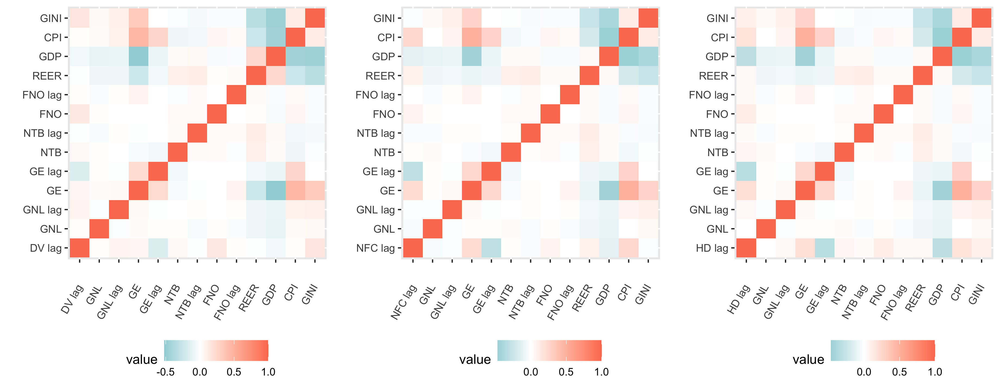

```{r setup, include=FALSE}
knitr::opts_chunk$set(echo = TRUE)
if (!require("pacman")) install.packages("pacman"); library(pacman)
p_load(tidyverse, knitr, kableExtra, rmarkdown, ggplot2, ggpubr, modelsummary, gt, reshape2)

load("./data_model/model.RData")
```


# Statecraft or Development Origin of Financialization?

In retrospect to the global financial crisis in 2008, the most devastating one since the Great Depression, many researchers have noted that finance is changing the economy in substantial ways. These studies, in general, use the term “financialization” in three layers (Carruthers and Kim 2011; Van der Zwan 2014). At the market level, financialization is depicted as an expanding share of the finance sector in the economy (Dore 2002; Epstein 2005; Wade 2005). From the perspective of corporations, financialization is referred to as the broadening profits from financial channels in nonfinancial firms and the pervasive adoption of corporate governance structure among firms (Stockhammer 2004; Orhangazi 2008; Davis 2009; Krippner 2011). In terms of the household-level, financialization is the heavier household debt and larger personal investment in financial products (Dynan 2009; Lin and Tomaskovic-Devey 2013; Fligstein and Goldstein 2015). 

In explaining these trends, recent sociological studies have attributed its root to the rise of financialization as an unanticipated consequence driven by the welfare state’s strategies dealing with crisis during the 1970s (Krippner 2011; Prasad 2012; Quinn 2019). Facing economic, social, and political dilemmas in the 1970s, policymakers in the welfare state, typically the United States, find expanding credit great help in fixing the fragmental fiscal system as well as enlarging its public spending budgets (Krippner 2011). In this scenario, the “lightness” of credit makes it a perfect tool for the welfare state to solve its crisis without huge losses and burdens. This strategy then typically boosts the expansion of the finance sector as well as the financial speculation in the market. The incremental demands on liquidation further deregulate the financial market, in turn spurring financialization and triggering the 2008 financial crisis. Given this theory’s focus on statecraft as a response to the fiscal crisis, we call this theory the Statecraft Model.

Alternatively, pre-2008 historical sociology work suggests financialization as an inevitable result of intensified competition and uneven development in the world market (Harvey 1985; Arrighi 1994, 2007; Brenner 2003). They suggest that the escalated competition in the commodity market has forced “higher-cost incumbent firms” to divert “a growing proportion of their incoming cash flows from investment in fixed capital and commodities to liquidity and accumulation through financial channels” (Arrighi 2007: 141). Most of these “higher-cost incumbent firms” reside in more developed countries given their higher price of productive resources. When these firms retreat from the commodity market, these more developed countries become more dependent on imports from less developed countries where lower-cost firms locate. Such process has finally led to long-term trade deficit in more developed import countries, boosting the expectation of ever-growing domestic currency value. Together with other international capital inflow, capital from “higher-cost incumbent firms” has returned back to more developed countries, boosting the financial market in more developed countries. Given this theory’s center on the economic development stage within the global system, we name this theory as the Development Model.

Despite their disparate focus on the origin of financialization, these two schools of theory share two implicit assumptions on the level and the unit of financialization. First, the statecraft model has differentiated financialization at the market- and the corporate- level, it has accorded with the development model, who does not explicitly distinguish financialization at various layers, to treat financialization as a unified trend that co-occur at all of the three layers: market-, corporate-, and household-. Researchers have conceived financialization as an entity that the three layers are its different features in various levels. Second, the statecraft model has mainly developed on the explanation of the rise of the financialization in the case of the United States, assuming it as a U.S.-specific phenomenon. Similarly, the development model pays greater attention to the case of the U.S., or at best illustrates financialization as something occuring only to a country with both fragmental politics and economic hegemony.  

In this article, we challenge both assumptions by arguing that the three layers of financialization is not as consistent as the literature implies. Financialization is more of an umbrella covering a bunch of phenomena than an entity with singular logics across different levels. Concurrently or not, financialization could occur separately at each layer or at diverse combinations of layers. Moreover, with the sole focus on the U.S. case, it is difficult to determine whether varieties of financialization exist in other countries and thus doubtful to confirm that financialization is a unique phenomenon limited to the U.S. We first test whether financialization at the market-, corporation-, and household-level can be observed to a wider range of countries, and then test the two explanatory models to these countries at the three levels independently. Our finding in a nutshell is that, with the existence of a variety of financialization, while the development model might be U.S.-specific, the statecraft model explains the trends of financialization in many other countries. 

# Varieties of Financialization

Financialization has been found in multiple arenas (Carruthers and Kim 2011; Van der Zwan 2014). A major branch of literature approaches financialization at the level of the market, depicting it as the rise or even the dominance of the finance industry over the real economy (Dore 2002, Epstein 2005, Wade 2005). The process is often measured by the contributions of the finance sector to the gross domestic product (GDP) or the total profit (e.g., Krippner 2011; Sassen 2012). Researchers also pointed out that the finance industry might be more important in the labor market (Castells 1996; Fingleton 1999), though the argument is not empirically supported by the U.S case (see Krippner 2011). It is true, however, the earnings of financial workers have been rapidly growing (Sum et al. 2008). This intuitive definition can be applied to illustrate the trend appearing not only in a small group of developed countries but across different countries under diverse political regimes with various levels of development (see Sassen 2012:46).

For some researchers, financialization is more a behavioral shift that occurred to market agents than a structural transformation in the market (Stockhammer 2004; Orhangazi 2008; Krippner 2005; 2011). They suggest that even non-financial corporations (NFCs) have become more reliant on financial channels to grasp additional profits to their traditional productive activities. For example, Duménil and Lévy (2004:82) define financialization as “the growth of financial enterprises, the rising involvement of non-financial enterprises in financial operations''. In his analysis of the period 1952-2005, Orhangazi (2008) observes that NFCs have paid rising fees to financial agencies or through the financial market.  Meanwhile, corporate management has been increasingly considered as something to satisfy shareholders (Davis 2009; Fligstein 1993).

The third branch of literature to define the financialization focuses on the role of household investors. With the advent of defined contribution pension plans,  employees have become individual investors in the financial market to pick up fund investments. Additionally, since the late 1970s, more households begin to put their savings in money market funds and later in equity mutual funds and stock markets for better payback (Davis 2009; Tomaskovic-Devey and Lin 2011; Quinn 2019). The proportion of household investment in the stock market changed from 20% to 52% during 1983 and 2002 (Davis 2009:213). Fligstein and Goldstein (2005) recognize that a finance culture has emerged among American households since the late 1980s. Individuals and households have relied more on credits and debts in everyday life. The household debts against GDP increased from 45% in 1976 to 96% in 2009 in the U.S. (Stockhammer 2010). Finance has been a major factor in expanding earnings dispersions among workers (Tomaskovic-Devey and Lin 2013).

Although financialization has been defined and measured in multiple layers, the process has been majorly perceived as a holistic trend. Researchers regard financialization as an entity that co-occurs at three layers. For example, when Tomaskovic-Devey and Lin (2013) discuss the reason for the upsurge of individual loans, they attribute it to the financialization at the corporation-level. Financialization is apparently assumed to be a phenomenon influencing markets, corporations, and households equivalently. This assumption, however, lacks empirical base requires further empirical tests. Analytically, a large financial section in the market does not necessarily contribute to the financial speculation of non-financial corporations or the household debts, and vice versa. We use the term “varieties of financialization” (like “varieties of capitalism”) to suggest that financialization is an umbrella concept covering multiple kinds of patterns. While there might be “full financialization” whereby the larger financial section, the non-financial corporation speculation, and the soaring household debts are co-occurring, other types of financialization might also exist that feature only one or two dimensions. 

This requires us to introduce an international perspective in order to discover more patterns of financialization in other countries. While some papers discuss financialization with a global view (e.g., Dore 2008), most existing studies infer financialization as an event exclusively present in the U.S. (e.g., Krippner 2019). Instead of limiting financialization in the U.S., we define financialization as “the persistent and independent growth over an expansive temporal period in at least one dimension below: the size of the financial industry, the speculations of non-financial corporations, or the financial engagement of households.” As financialization may cover more than one social phenomenon, it might be risky to explain financialization with a singular model. We therefore explore the existing explanation of financialization (mainly in the U.S., though) and develop them into two general models to explain financialization at the national level. 

# Development Pitfall or Statecraft Contingency

The development model has described the rise of financialization as a result of capital rationalization under intensified international competition in the world market (Arrighi 1994, 2007; Brenner 2003). Lenin (1999[1917]) has illustrated this process as “the concentration of production; the monopolies arising therefrom; the merging or coalescence of the banks with industry -- such is the history of the rise of finance capital and such is the content of that concept”. The profit-maximizing feature of capital has an intrinsic tendency to expand relentlessly to grab resources or productive materials with the lowest cost, creating a world market geographically and multinational multi-industries corporations vertically. At the beginning, capital from more developed countries flows out into less developed countries to search for low-priced raw materials, starting to connect with local business in these less developed countries. Next, capital “discovers” lower-cost human resources and establishes factories on the spot, deepening the connections with these countries. Such connections and outflow of capital from more developed countries in search for lower-cost productive materials have strengthened and reinforced the creation of the world-market. At the same time, outflowing capital has utilized the structure of multinational corporations to maximize its profits with tricks including tax avoidance and accounting operations. However, with the establishment of the world market, capital from the less developed countries has started to join into the international competition, reducing the rate of profit for those more developed capital given their higher-cost within their countries. One solution for the capital from more developed countries is diversification, broadening their business into diverse industrial niches to seek for new “markets” with higher rates of profit. When this solution produces a decreasing rate of return to a certain threshold to the extent of the heightened inter-capitalist competition becoming a zero- or negative-sum game, the final resort rests in what Schumpeter calls “headquarters of the capitalist system” -- the money market (Arrighi 2007). 

In this process, more developed countries gradually become the consumptive-import camp (usually the U.S. but also Western European countries) who rely on cheap and affluent imports to maintain their high consumption and low inflation, while less developed countries competing in the world market are seen as the productive-export camp (typically East and Southern Asian countries) who export to the other camp to ensure full employment and economic growth. Despite several temporary reversals, this global structure of the economic system has resulted in a long-term trade deficit as well as current account deficit in the consumptive-import camp, pushing up the value of their domestic currency. Increasing value of domestic currency has further boosted their exchange rate to other currencies. This boost has attracted both those capital originally from the consumptive-import countries and international capital to flow back into these countries, most of which flows into the stock market and the real estate market. Consequently, there is a rise of financialization within the consumptive-import camp.     

An alternative explanation, emerging more recently, explores financialization as a contingent, expedient event, which one can find in many countries regardless of their levels of industrialization. Different from the Hegemony model, the students in the school are more interested in the role of the state in shaping the financialization. Most of them believe that financialization in the U.S. is a combining result of its fragmented politics and historical trajectories in the 20th century (Fligstein 1993; Carruthers 1996; Krippner 2011; Prasad 2014; Quinn 2017; 2019). For example, Krippner (2011) explains how the U.S. government’s solutions on three crises in the shift from postwar prosperity to neoliberalism have led to financialization. Prasad (2014), instead, believes that the beginning of financialization should be traced to as early as the early 20th century when home mortgages emerged as an unanticipated result of the peasant movements. Although different in causality, both of them agree that the financialization in the U.S. is an isolated, contingent event. According to them, financialization is more likely to occur in a country with its government overwhelmed by deficits. 

The development model and the statecraft model are different in major aspects. The major cause of financialization for the former is a trade deficit, while for the later a budget deficit. In terms of the relationship with the system of capitalism, financialization depicted by the development model is internal to the production mode of capitalism and therefore somehow teleological. The imbalancing nature of the global trade will definitely separate the productive-export countries from the consumptive-import countries. Financialization is a necessary consequence of this separation, though sometimes repressed with the imbalance relieved (e.g., by weapon trade between the U.S. and its allies during the Cold War). According to the development model, the rise of financialization is a unique phenomenon in the consumptive-import countries because of their special position of trade deficit in the long term that continuously pushes up their currency value and attracts increasing capital inflow into their financial market. Such a process is less likely present in less developed countries. In contrast, the statecraft model portrays financialization as more contingent as a consequence of certain historical events (for the U.S. case, the 1970s oil crisis, the Vietnam war, the loosening antitrust, etc.). As a result, the development model predicts that financialization is conditioned to the consumptive-import countries only, while the financialization of the statecraft model applies universally to any country with expanding government spendings.

# Hypotheses

# Data and Method

# Results

```{r, fig.cap="Stationarity of Financialization Measures across 39 Countries", out.height = "40%", out.weight = "40%", echo = FALSE}

```

```{r ip, fig.cap="Variable Correlations of The Three Models", out.height = "30%", out.weight = "30%", echo = FALSE}

```

```{r echo = FALSE, rsult = 'asis'}
#Table for model selection
ms <- read.csv("./table_and_figure/model_selection.csv")
kbl(ms, booktabs = T, digit = 3,
    caption = "Model Selection Tests",
    col.names = rep(c("", "Value Added", "NFC debts", "Household Debts"))) %>%
  pack_rows("Breusch-Pagan LM test for cross-sectional dependence",1,2) %>%
  pack_rows("Breusch-Pagan test for heteroskadasticity",3,4) %>%
  pack_rows("Breusch-Godfrey test for serial correlation",5,6)

```


```{r echo = FALSE, rsult = 'asis'}
#Table for PCSE models
options(modelsummary_html = 'kableExtra')

m1_table <- m1_lm
m1_table[1] <- m1_pcse[3]
m1_table$pcse <- m1_pcse[2]

m2_table <- m2_lm
m2_table[1] <- m2_pcse[3]
m2_table$pcse <- m2_pcse[2]

m3_table <- m3_lm
m3_table[1] <- m3_pcse[3]
m3_table$pcse <- m3_pcse[2]


models <- list()
models[['M1: Values added']] <- m1_table
models[['M2: NFC debts']] <- m2_table
models[['M3: Household debts']] <- m3_table

cm <- c("(Intercept)" = "(Intercept)",
         'DV_VA_pc_lag1' = "Dependent variable (lag 1)",
        'DV_nfc_ls_pc_lag1' = "Dependent variable (lag 1)",
        'DV_hh_ls_pc_lag1' = "Dependent variable (lag 1)",
        'IV_lending_pc' = "Government net lending",
         "IV_lending_pc_lag1" = "Government net lending (lag 1)",
        "IV_gov_exp_pc" = "Government expenditure",
        "IV_gov_exp_pc_lag1" = "Government expenditure (lag 1)",
        "IV_trade_balance_pc" = "Net trade balance",
        "IV_trade_balance_pc_lag1" = "Net trade balance (lag 1)",
        "IV_fdi_net_pc" = "FDI net outflows",
        "IV_fdi_net_pc_lag1" = "FDI net outflows (lag1)",
        "C_REER" = "Real Effect Exchange Rates",
        "C_wgdp" = "GDP",
        "C_cpi" = "CPI",
        "C_wgini" = "GINI")

modelsummary(models,
         statistics = "pcse",
         stars = TRUE,
         coef_map = cm,
         title = "Dynamic Regression Models with Panel-Corrected Standard Errors, 1972-2018") %>%
   pack_rows("Statecraft contigency", 5, 12) %>%
   pack_rows("Development pitfall", 13,20) %>%
   pack_rows("Control variable", 21, 28) 

```


```{r echo = FALSE, rsult = 'asis'}
# Table for ecm
model2 <- list()
model2[['M4: Values added']] <- m1_ecm
model2[['M5: NFC debts']] <- m2_ecm
model2[['M6: Household debts']] <- m3_ecm

cm2 <- c("(Intercept)" = "(Intercept)",
         'ylag1' = "Dependent variable (lag 1)",
        'deltaIV_lending_pc' = "Government net lending",
         "IV_lending_pcLag1" = "Government net lending (lag 1)",
        "deltaIV_gov_exp_pc" = "Government expenditure",
        "IV_gov_exp_pcLag1" = "Government expenditure (lag 1)",
        "deltaIV_trade_balance_pc" = "Net trade balance",
        "IV_trade_balance_pcLag1" = "Net trade balance (lag 1)",
        "deltaIV_fdi_net_pc" = "FDI net outflows",
        "IV_fdi_net_pcLag1" = "FDI net outflows (lag1)",
        "C_REER" = "Real Effect Exchange Rates",
        "C_wgdp" = "GDP",
        "C_cpi" = "CPI",
        "C_wgini" = "GINI")

modelsummary(model2,
         statistics = "Std. Error",
         stars = TRUE,
         coef_map = cm2,
         title = "Error Correction Models, 1972-2018") 

```