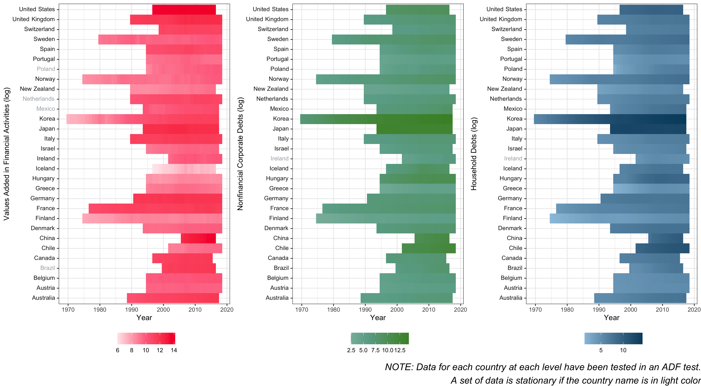

```{r setup, include=FALSE}
knitr::opts_chunk$set(echo = TRUE)
if (!require("pacman")) install.packages("pacman"); library(pacman)
p_load(tidyverse, knitr, kableExtra, rmarkdown, ggplot2, ggpubr, modelsummary, gt, reshape2)
#p_load(officer, officedown, knitr, bookdown)
load("./data_model/model.RData")
```


# Statecraft or Development Origin of Financialization?

In retrospect to the global financial crisis in 2008, the most devastating one since the Great Depression, many researchers have noted that finance is changing the economy in substantial ways. These studies, in general, use the term “financialization” in three layers [@carruthers2011sociology; @van2014making]. At the market level, financialization is depicted as an expanding share of the finance sector in the economy [@dore2002stock; @epstein2005financialization; @wade2005march]. From the perspective of corporations, financialization is referred to as the broadening profits from financial channels in nonfinancial corporations (NFCs) and the pervasive adoption of corporate governance structure among firms [@stockhammer2004financialisation; @orhangazi2008financialization; @davis2013financialization; @krippner2011capitalizing]. In terms of the household-level, financialization is the heavier household debt and larger personal investment in financial products [@dynan2009changing,; @lin2013financialization; @fligstein2015emergence]. 

In explaining these trends, recent sociological studies have attributed its root to the rise of financialization as an unanticipated consequence driven by the welfare state’s strategies dealing with crisis during the 1970s [@krippner2011capitalizing; @prasad2012land; @quinn2019american]. Facing economic, social, and political dilemmas in the 1970s, policymakers in the welfare state, typically the United States, find expanding credit great help in fixing the fragmental fiscal system as well as enlarging its public spending budgets [@krippner2011capitalizing]. In this scenario, the “lightness” of credit makes it a perfect tool for the welfare state to solve its crisis without huge losses and burdens. This strategy then typically boosts the expansion of the finance sector as well as the financial speculation in the market. The incremental demands on liquidation further deregulate the financial market, in turn spurring financialization and triggering the 2008 financial crisis. Given this theory’s focus on statecraft as a response to the fiscal crisis, we call this theory _the Statecraft Model_.

Alternatively, pre-2008 historical sociology work suggests financialization as an inevitable result of intensified competition and uneven development in the world market [@harvey1985geopolitics; @arrighi1994long; @arrighi2007adam; @brenner2003boom]. They suggest that the escalated competition in the commodity market has forced “higher-cost incumbent firms” to divert “a growing proportion of their incoming cash flows from investment in fixed capital and commodities to liquidity and accumulation through financial channels” [@arrighi2007adam :141]. Most of these “higher-cost incumbent firms” reside in more developed countries given their higher price of productive resources. When these firms retreat from the commodity market, these more developed countries become more dependent on imports from less developed countries where lower-cost firms locate. Such process has finally led to long-term trade deficit in more developed import countries, boosting the expectation of ever-growing domestic currency value. Together with other international capital inflow, capital from “higher-cost incumbent firms” has returned back to more developed countries, boosting the financial market in more developed countries. Given this theory’s center on the economic development stage within the global system, we name this theory as _the Development Model_.

Despite their disparate focus on the origin of financialization, these two schools of theory share two implicit assumptions on the level and the unit of financialization. First, the statecraft model, though differentiating financialization at the market- and the corporate-level, has accorded with the development model, who does not explicitly distinguish financialization at various layers, to treat financialization as a unified trend that co-occur at all of the three layers: market-, corporate-, and household-. Researchers have conceived financialization as an entity that happens at three layers simultaneously. Second, the statecraft model has mainly developed on the explanation of the rise of the financialization in the sophisticated contexts of the United States, assuming it as a U.S.-specific phenomenon. Similarly, the development model pays greater attention to the case of the U.S., or at best illustrates financialization as something occuring only to a country with both fragmental politics and economic hegemony.

In this article, we challenge both assumptions by testing the two models at different layers of financialization to a broader range of countries. To avoid ambiguity seen in previous studies, we   define financialization as the persistent and independent growth over an expansive period within a country in at least one dimension below: the size of the finance industry, the financial speculation of non-financial corporations, or the engagement of households in the finance market. Our tests show that financialization is a widespread phenomenon that could be observed in both developed and developing economies, and thus not a “American exceptionalism” issue. Moreover, it is not a unified entity but could occur separately at different levels, more of a “varieties of financialization” phenomenon than “systemic financialization”. As for the key source for the rise of financialization, we find that the statecraft model is more persuasive to illustrate the increase in the size of the finance industry and the engagement of households in the finance market in a country. Instead, the development model shows stronger evidence to predict the rise of the national financial speculation of non-financial corporations. Our findings are based on a time-series cross-section regression analysis of 30 advanced and developing countries from 1972 to 2011.  


# American Exceptionalism, Varieties of Financialization, and Systemic Financialization

Researchers have studied financialization from perspectives of the market as a whole and market players/agents [@carruthers2011sociology; @van2014making]. A major branch of literature approaches financialization at the level of the market, depicting it as the rise or even the dominance of the finance industry over the real economy [@dore2002stock; @epstein2005financialization, @wade2005march]. The process is often measured by the contributions of the finance sector to the gross domestic product (GDP) or the total profit [e.g., @krippner2011capitalizing; @sassen2012global]. Researchers also pointed out that the finance industry might be more important in the labor market [@castells1998information; @fingleton1999praise], though the argument is not empirically supported by the U.S case (see @krippner2011capitalizing). It is true, however, the earnings of financial workers have been rapidly growing [@sum2008great]. This intuitive definition can be applied to illustrate the trend appearing not only in a small group of developed countries but across different countries under diverse political regimes with various levels of development [see @sassen2012global :46].        

For some researchers, financialization is more of a behavioral shift that occurred to market agents than a structural transformation in the market [@stockhammer2004financialisation; @orhangazi2008financialization; @krippner2005financialization; @krippner2011capitalizing]. They suggest that even non-financial corporations have become more reliant on financial channels to grasp additional profits to their traditional productive activities. For example, Duménil and Lévy [@dumenil2004capital :82] define financialization as “the growth of financial enterprises, the rising involvement of non-financial enterprises in financial operations''. In his analysis of the period 1952-2005, Orhangazi [@orhangazi2008financialization] observes that NFCs have paid rising fees to financial agencies or through the financial market. Meanwhile, corporate management has been increasingly considered as something to satisfy shareholders [@davis2009rise; @fligstein1993transformation].

The third branch of literature to define the financialization focuses on the role of household investors. With the advent of defined contribution pension plans, employees have become individual investors in the financial market to pick up fund investments. Additionally, since the late 1970s, more households begin to put their savings in money market funds and later in equity mutual funds and stock markets for better payback [@davis2009rise; @lin2013financialization; @quinn2019american]. The proportion of household investment in the stock market changed from 20% to 52% during 1983 and 2002 [@davis2009rise :213]. Fligstein and Goldstein [@fligstein2015emergence] recognize that a finance culture has emerged among American households since the late 1980s. Individuals and households have relied more on credits and debts in everyday life. The household debts against GDP increased from 45% in 1976 to 96% in 2009 in the U.S. [@stockhammer2004financialisation]. Finance has been a major factor in expanding earnings dispersions among workers [@lin2013financialization].

Despite the above classifications of financialization at diverse layers, it is implicitly assumed as a singular trend that appears exclusively in the United States rather than a global movement sweeping all countries [an important exception is @dore2008financialization]. Arrighi [@arrighi1994long] is known to approach financialization as a terminological ending stage of hegemony in a capitalist cycle. The contemporary financialization is associated with the decline of the U.S. Many other studies that explain the rise of financialization, in contrast, bring in a rich historical context of the U.S. and suggest financialization is an unanticipated consequence of the U.S. politics [e.g., @krippner2005financialization; @prasad2012land; @quinn2019american, see below for a more detailed review]. The statement of financialization as “American exceptionalism” could be dubious if a persistent growth of the financial industry and activities is considered as the evidence of financialization. When such evidence of financialization is found in any other countries, as we will show below, it suggests that financialization is not unique to a hegemon, neither is it a contingent outcome of the 19th and 20th centuries solely in the U.S..  

If financialization is cross-national, we will need to distinguish whether financialization, with its three-layer features, is a global trend of a common cause, or an espetimic tool to describe different phenomena. For the former situation, we expect “systemic financialization”: a phenomenon that not only exists in diverse countries but also co-occurs through multiple layers as a singular and homogenous trend. This ideal type of financialization emphasizes that all the three levels of financialization are interconnected and transform simultaneously. Researchers also attribute the rise of this type of financialization to a common origin such as the loosening credits in the past decades [e.g., @quinn2019american] or the global rise of shareholder values [@dore2008financialization, see below for more details]. They typically suggest it starts with cheap credits and followed by the booming stock market, which later expands to non-financial sections including corporations and households. 

Other discussions propose unique reasons for the occurence of financiationalization at different levels. For example, the speculations of non-financial corporations are explained as a result of the anti-trust regulations and “the transformation of corporation control” [@fligstein1993transformation] or the structural changes of corporation elites [@mizruchi2013fracturing; @lachmann2020first]. Such explanations on independent layers of financialization indicate that, contrary to “systemic financialization”, the conception of financialization, as a description of both the financial behaviors and the market structure, is not necessarily a singular entity with a common cause. It might also be a conceptual umbrella to cover a series of similar phenomena with different causes. We recognize this thesis as “varieties of financialization” (just like “varieties of capitalism”), suggesting the concept of financialization is not a singular trend but a concept to generalize different trends. Our tests support an observation that the three levels of financialization 

# Development Pitfall or Statecraft Contingency

The development model has described the rise of financialization as a result of capital rationalization under intensified international competition in the world market [@arrighi2007adam; @arrighi1994long; @brenner2003boom]. Lenin [@lenin1999imperialism] has illustrated this process as “the concentration of production; the monopolies arising therefrom; the merging or coalescence of the banks with industry -- such is the history of the rise of finance capital and such is the content of that concept”. The profit-maximizing feature of capital has an intrinsic tendency to expand relentlessly to grab resources or productive materials with the lowest cost, creating a world market geographically and multinational multi-industries corporations vertically. At the beginning, capital from more developed countries flows out into less developed countries to search for low-priced raw materials, starting to connect with local business in these less developed countries. Next, capital “discovers” lower-cost human resources and establishes factories on the spot, deepening the connections with these countries. Such connections and outflows of capital from more developed countries in search for lower-cost productive materials have strengthened and reinforced the creation of the world-market. At the same time, outflowing capital has utilized the structure of multinational corporations to maximize its profits with tricks including tax avoidance and accounting operations. However, with the establishment of the world market, capital from the less developed countries has started to participate into the international competition, reducing the rate of profit for those capital from more developed countries given their higher-cost. One solution for these higher-cost capital is diversification, broadening their business into diverse industrial niches to seek for new “markets” with higher rates of profit. When this solution produces a decreasing rate of return to a certain threshold to the extent of the heightened inter-capitalist competition becoming a zero- or negative-sum game, the final resort rests in what Schumpeter calls “headquarters of the capitalist system” -- the money market [@arrighi2007adam]. 

In this process, more developed countries have gradually become the consumptive-import camp (usually the U.S. but also Western European countries) who rely on cheap and affluent imports to maintain their high consumption and low inflation, while less developed countries competing in the world market are seen as the productive-export camp (typically East and Southern Asian countries) who export to the other camp to ensure full employment and economic growth. Despite several temporary reversals, this global structure of the economic system has resulted in a long-term trade deficit as well as current account deficit in the consumptive-import camp, pushing up the value of their domestic currency. Increasing value of domestic currency has further boosted their exchange rate to other currencies. This boost has attracted both those capital originally from the consumptive-import countries and international capital to flow back into these countries, most of which flows into the stock market and the real estate market. Consequently, there is a rise of financialization within the consumptive-import camp.     

Different from the development model, researchers of the statecraft model are more interested in the role of the state in shaping the financialization. Most of them believe that financialization in the U.S. is a combining result of its fragmented politics and historical trajectories in the 20th century [@fligstein1993transformation; @carruthers1996state; @krippner2011capitalizing; @prasad2012land;@quinn2017miracles;@quinn2019american]. For example, Krippner [@krippner2011capitalizing] explains how the U.S. government’s solutions on three crises in the shift from postwar prosperity to neoliberalism have led to financialization. Prasad [@prasad2012land], instead, believes that the beginning of financialization should be traced to as early as the early 20th century when home mortgages emerged as an unanticipated result of the peasant movements. Although different in causality, both of them agree that the financialization in the U.S. is an isolated, contingent event. According to them, financialization is more likely to occur in a country with its government overwhelmed by deficits. 

The development model and the statecraft model are different in major aspects. The major cause of financialization for the former is a trade deficit, while for the later a budget deficit. In terms of the relationship with the system of capitalism, financialization depicted by the development model is internal to the production mode of capitalism and therefore somehow teleological. The imbalancing nature of the global trade will definitely separate the productive-export countries from the consumptive-import countries. Financialization is a necessary consequence of this separation, though sometimes repressed with the imbalance relieved (e.g., by weapon trade between the U.S. and its allies during the Cold War). According to the development model, the rise of financialization is a unique phenomenon in the consumptive-import countries because of their special status of trade deficit in the long term that continuously pushes up their currency value and attracts increasing capital inflow into their finance market. Such a process is less likely present in less developed countries. In contrast, the statecraft model portrays financialization as more of a contingent consequence of certain historical events (for the U.S. case, the 1970s oil crisis, the Vietnam war, the loosening antitrust, etc.). As a result, the development model predicts that financialization is conditioned to the consumptive-import countries only, while the financialization of the statecraft model applies universally to any country with expanding government spending.

# Hypotheses

We first test the thesis of “American exceptionalism” to explore whether financialization is peculiar to the U.S. The strategy is to observe whether the three levels of financialization take place only to the United States. Financialization, according to our definition, is measured by the persistent growth of any of the three levels of the financial market, the NFC speculation, and the household debts. “American exceptionalism” is validated under the situation where no evidence supports financialization in other countries than the U.S. Under that scenario, the U.S. financialization would be the only observed form of the phenomenon. We therefore propose our first hypothesis.

_Hypothesis_ 1: Financialization occurs only in the U.S. 

We then test the theses of “systemic financialization” and “varieties of financialization” by observing whether the three levels of financialization could be explained totally by a single theory. Driven by the existing literature, we test the rise of  financialization with the statecraft model and the development model. The statecraft model has argued that the rise of financialization is indeed an inadvertent result of the welfare state’s efforts to solve its economic, social, and political crisis [@krippner2011capitalizing]. To repossess the sovereignty legitimacy endangered by the domestic fiscal deficit and increasing income gap, policymakers have technically turned toward neoliberalism by imposing market mechanism at the center of their policy design. This series of policy shifts include first deregulating the domestic financial markets, resulting in a great expansion of  credit in the economy, and second imposing seriously high interest rates in monetary policy, which in turn draws unprecedented foreign capital inflows domestically that pushes credit to an even higher level, and finally marketizing monetary policy with the setting of volatile interest rates so that the state is second to the market to be blame when an economic downturn deepened. The statecraft model has pointed out that in this whole process, policymakers have no original intention to enlarge the credit or expand the finance industry. Instead, they use a financial toolkit to conceal the state from the market. As an accidental consequence, there appears a great expansion of credit within the domestic market while pushing the rise of financialization as a whole.

The statecraft model has demonstrated that the augmentation of domestic credit will directly prompt the expeditious surge of the finance, a consequence depicted as a market-level financialization [@dore2002stock; @epstein2005financialization; @wade2005march]. With the affluence of credit and the prosperity of the finance sector, corporations, financial and especially nonfinancial firms, have quickly learnt to use financial channels to broaden their profits and to adopt corporate governance structure to facilitate their daily operations, which is considered as a corporation-level financialization [@stockhammer2004financialisation; @orhangazi2008financialization; @davis2009rise; @krippner2011capitalizing]. Following the establishment of the credit system and the abundance of financial products offered by the market, households become debt borrowers and personal investors, a phenomenon as the rise of financialization at the household level [@dynan2009changing; @lin2013financialization; @fligstein2015emergence]. If the statecraft model illustrates an accurate picture, we can observe a statistically significant positive relationship independently between the rise of financialization at the market-, corporation-, and household-level and the expansion in domestic government spending. This leads to our first group of hypotheses:

_Hypothesis_ 2a: The rise of financialization at the market-level is positively correlated with the growth of the domestic government spending.

_Hypothesis_ 3a: The rise of financialization at the corporation-level is positively correlated with the growth of the domestic government spending.

_Hypothesis_ 4a: The rise of financialization at the household-level is positively correlated with the growth of the domestic government spending. 	 

In contrast to the statecraft model’s neoliberal explanation, the development model illustrated the rise of financialization as an inevitable outcome of the intensified international competition within capitalism. The logic of the product cycle for capital from the leading countries is to seek endlessly for new market niches that return a higher rate of profit in a positive-sum game. When competition has heightened to an extent that lowers the profit to a certain threshold to a zero- or negative-sum game, rational capital gives up reinvestment into the commodity markets but turns to their final refuge, the financial market [@arrighi2007adam :142]. Given their lower-cost, the participation of capital from less developed countries in the world market has lowered down the profit for capital from more developed countries and drives them out of the manufacturing industry first and later other commodity industries. This process has created two interdependent camps -- the productive-export camp (typically East and Southern Asian countries) and the consumptive-import camp (usually the U.S. but also Western European countries) and consumptive-import camp’s trade deficit in the long time despite several temporary switches. Constant trade deficit has resulted in a continuous increase of domestic currency value within the consumptive-import camp, attracting even more capital flows back into their financial market together with those from other countries.    

The increasing inflow of capital into the stock and real estate market within the consumptive-import countries has directly expanded the financial market. The shift of higher-cost non-financial firms from the traditional commodity market to the financial market has boosted their usage of financial channels to make profits, a presentation of financialization at the corporation level. With the transition to a consumptive-import economy, domestic credit for consumption has been enlarged by the state to spur more consumption to boost economic development. This increase in credit has resulted in households’ accustomed to debt and securities, a phenomenon of households-level financialization. If the development model points to a persuasive direction, we can observe a statistically significant positive relationship between the rise of financialization at the market-, corporation-, and household-level and the foreign trade deficits independently. This leads to our second set of hypotheses:

_Hypothesis_ 2b: The rise of financialization at the market-level is positively correlated with the foreign trade deficits.

_Hypothesis_ 3b: The rise of financialization at the corporation-level is positively correlated with the foreign trade deficits.

_Hypothesis_ 4b: The rise of financialization at the household-level is positively correlated with the foreign trade deficits.

# Data and Method

The existing literature identifies financialization occurring at the market-, corporation-, and household-level [@carruthers2011sociology; @van2014making]. We thus select three dependent variables to gauge the financialization through these levels. At the market-level, we use the _value added in financial activities_, which is defined as the percentage change of the value added in finance and insurance activities from a year earlier. A percentage of total value added (OECD 2021), value added by finance and insurance activities indicates the size of the finance sector in an economy. The percentage change of this indicator suggests the growth rate of this sector.

The dependent variable _nonfinancial corporate debts_ is defined as the percentage change of the nonfinancial corporate debt, loans, and debt securities from a year earlier, measuring the trend of financialization at the corporation-level. An important definition of financialization examines nonfinancial firms’ commitments on financial channels to make profits [@orhangazi2008financialization; @davis2009rise; @krippner2011capitalizing]. Observing the percentage change of nonfinancial corporate debt, loans, and debt securities by year operationalizes this significant conceptualization. The dependent variable to depict the financialization at the household-level is _household debts_, the percentage change of the household debt, loans, and debt securities from a year earlier. Household debts assess the level of households’ engagements in the financial market to support their family lives, and the percentage change of this figure by year portrays the growth rate of households’ engagements in the financial market. Both _nonfinancial corporate debts_ and _household debts_ from the IMF database are represented as a percentage of GDP [@imfnfc]. We have transformed them into the amount denoted by the current USD to ensure the three dependent variables are measurable.

We choose two sets of independent variables to calibrate the two models. The statecraft model examines the relationship between the level of financialization and the growth of domestic government spending, we apply _government net lending_ and _government expenditure_ to measure the growth of a country’s domestic government spending. The first independent variable _government net lending_ refers to the percentage change of the general government net lending from a year earlier. The general government net lending is defined as the balance of income and expenditure of government, including capital income and capital expenditures. A positive number indicates that the government has a surplus, and is providing financial resources to other sectors, while a negative number means that the government has a deficit, and requires financial resources from other sectors [@oecddeficit]. Because number signs represent different meanings, we use the absolute value as the denominator to calculate the percentage change. This operation helps capture the accurate direction of the increase or decrease in government net lending. A positive percentage change in _government net lending_ means a step moving towards the surplus of government spending, implying a decrease in government spending. Following the same logic, a negative percentage change in _government net lending_ demonstrates an increase in government spending.The second independent variable _government expenditure_ is a measurement of percentage change of the non-interest government expenditure by year [@mauro2013modern]. A positive percentage change in _government net lending_ or _government expenditure_ suggests an increase in government spending, while a negative change indicates a decrease. Before the percentage change, both government net lending from the OECD database and government expenditure from the IMF database are represented as a percentage of GDP [@oecddeficit; @mauro2013modern]. We have transformed them into the amount denoted by the current USD to ensure they are commensurate to the dependent variables. 

Alternatively, the other set of independent variables _net trade balance_ and _FDI net outflows_ measures the changes in foreign trade and foreign investment in the development model. The variable _net trade balance_ is defined as the percentage change of net trade in goods and services denoted by the current US dollar from a year earlier. Net trade in goods and services is derived by offsetting imports of goods and services against exports of goods and services [@wbnet]. A positive figure of net trade in goods and services represents a trade deficit while a negative number illustrates a trade surplus. A positive percentage change in _net trade balance_ indicates an increase in imports of goods and services, and a negative change denotes an increase in exports of goods and services. _FDI net outflows_ is the percentage change of the foreign direct investment (FDI) net outflows in current US dollar from a year earlier. FDI are the net inflows of investment to acquire a lasting management interest (ten percent or more of voting stock) in an enterprise operating in an economy other than that of the investor, a sum of equity capital, reinvestment of earnings, other long-term capital, and short-term capital in the balance of payments [@wbfdi]. Before the percentage change, _FDI net outflows_ are calculated as the FDI outflows deducted by the FDI inflows. A positive figure in net FDI outflows suggests assets, while a negative number represents liabilities. Because both _net trade balance_ and _FDI net outflows_ are denoted by different number signs, we again use the absolute value as the denominator to calculate their percentage change to ensure the accurate calculation.

Besides these core variables, we include four control variables that could influence the dependent variables. _Real effective exchange rates_ (REER) measures the real value of a country’s currency against the basket of its trading partners. Its changes show the evolution of a country’s aggregate external price competitiveness [@oecdreer]. _Inflation rate_ is measured as the growth rate of consumer price index (CPI) for all items from a year earlier. CPI is calculated as the change in the prices of a basket of goods and services that are typically purchased by specific groups of households [@oecdinflation]. _Gini index_  measures the extent to which the distribution of income among individuals or households within an economy deviates from a perfectly equal distribution. A Gini index of 0 represents perfect equality, while an index of 100 suggests perfect inequality [@wbgini]. We obtain the Gini index from the World Income Inequality Database (WIID), a database that has aggregated Gini index from diverse sources. To ensure the consistency in the selection, we have chosen Gini index in the following order: covering full area, possessing high quality, measured in per capita, based on the net income, sourced from good-quality databases such as the World Bank, including all population, and covering households as the base-unit[@wiidguide]. The last control variable, GDP, is gross domestic product (GDP) converted to 2017 US$ per capita [@wiidguide].

We obtain the above variables from the following databases: OECD, World Bank, IMF’s Global Debt Database, IMF’s Historical Finance Database, and World Income Inequality Database. Our sample consists of 30 countries that include both OECD members and emerging economies and covers the period 1972 to 2011. Table 1 presents the descriptive statistics of each variable and their sources. Figure 2 shows the correlation matrices for the three dependent variables. There are no obvious correlations between pairs of independent variables. 

We apply a separate augmented Dickey-Fuller (ADF) test on each country for each of the three dependent variables to test the first hypothesis. The ADF test checks the existence of a unit root in a time series data [@baltagi2008econometric]. When the null hypothesis of the existence of the unit root is rejected, this case is said to be stationary, and vice versa. We interpret a country with stationarity as a country with no obvious trend of financialization at that level, and a country with non-stationarity as one with observed financialization. Figure 1 presents the separate ADF test results and the changes in the logarithm of the three dependent variables for each country.

Since our data consists of repeated observations on a number of fixed and non sampled units (countries) that appeal to asymptotics involve the time dimension and are of interests by themselves, we utilize statistical models applying to time-series cross-sectional (TSCS) data [@darmofal2015spatial]. Traditionally, a feasible generalized least squares (FGLS) model is commonly used to fit linear models to TSCS data [@parks1967efficient], which has been proved inappropriate given this method’s underestimation of standard errors recently [@beck1995and]. A more accurate solution is estimating by ordinary least squares (OLS) with panel-corrected standard errors (PCSE), a sandwich type estimator of the covariance matrix of the estimated parameters [@bailey2011implementing; @beck2001time; @beck2001time]. We have adopted Breusch-Pagan test without Koenker’s studentized version of the test statistic to test against heteroskedasticity [@breusch1980lagrange, @koenker1981note,@kramer2012linear], which shows the existence of heteroskedasticity in the OLS model for each of the three dependent variables. To test cross-sectional dependence, we have used Pesaran’s CD statistics, Breusch and Pagan’s original and scaled LM statistics [@breusch1980lagrange, @pesaran2004general, @pesaran2015testing]. All three statistics suggest the three OLS models have cross-sectional dependence. Replacing OLS standard errors with PCSE will reduce the problems of panel heteroskedasticity and contemporaneous correlation of the errors in the OLS [@beck2001time]. Both heteroskedasticity and cross-sectional dependence tests are shown in Table 2.
    
```{r echo = FALSE, rsult = 'asis'}
options(knitr.kable.NA = '')
# Table for descriptive statistics and sources
p_load(DataCombine)
varnames = c("DV_VA_pc",
             "IV_lending_pc", "IV_gov_exp_pc", "IV_trade_balance_pc", "IV_fdi_net_pc",
             "C_REER", "C_wgdp","C_cpi","C_wgini")
desc_va <- data.frame()
for(varname in varnames){
  mean <- summary(unlist(va_df[,varname]))[4]
  median <- summary(unlist(va_df[,varname]))[3]
  sd <- sd(unlist(va_df[,varname]))
  newrow <- c(mean,median, sd)
  desc_va <- rbind(desc_va, newrow)
}

varnames = c("DV_nfc_ls_pc",
             "IV_lending_pc", "IV_gov_exp_pc", "IV_trade_balance_pc", "IV_fdi_net_pc",
             "C_REER", "C_wgdp","C_cpi","C_wgini")
desc_nfc<- data.frame()
for(varname in varnames){
  mean <- summary(unlist(nfc_df[,varname]))[4]
  median <- summary(unlist(nfc_df[,varname]))[3]
  sd <- sd(unlist(nfc_df[,varname]))
  newrow <- c(mean,median, sd)
  desc_nfc <- rbind(desc_nfc, newrow)
}

varnames = c("DV_hh_ls_pc",
             "IV_lending_pc", "IV_gov_exp_pc", "IV_trade_balance_pc", "IV_fdi_net_pc",
             "C_REER", "C_wgdp","C_cpi","C_wgini")
desc_hh <- data.frame()
for(varname in varnames){
  mean <- summary(unlist(hh_df[,varname]))[4]
  median <- summary(unlist(hh_df[,varname]))[3]
  sd <- sd(unlist(hh_df[,varname]))
  newrow <- c(mean,median, sd)
  desc_hh <- rbind(desc_hh, newrow)
}


desc_va <- InsertRow(desc_va, c(NA,NA, NA), RowNum =2)
desc_va <- InsertRow(desc_va, c(NA,NA, NA), RowNum =2)

desc_nfc <- InsertRow(desc_nfc, c(NA,NA, NA), RowNum =1)
desc_nfc <- InsertRow(desc_nfc, c(NA,NA, NA), RowNum =3)

desc_hh <- InsertRow(desc_hh, c(NA,NA, NA), RowNum =1)
desc_hh <- InsertRow(desc_hh, c(NA,NA, NA), RowNum =2)

desc <- cbind(desc_va, desc_nfc, desc_hh)


rownames <- c("Value added in financial activities (%)", "Nonfinancial corporation debts (%)", "Household debt (%)",
              "Government net lending (%)", "Government expenditure (%)",
              "Net trade balance (%)", "FDI net outflows (%)", 
              "Real Effect Exchange Rates", "GDP (Million Dollars)", "CPI", "GINI")
desc <- cbind(rownames, desc)


source <- c("OECD","IMF", "IMF",
           "OECD", "IMF","World Bank", "World Bank", "OECD", "WIID", "OECD","WIID")
desc <- cbind(desc, source)

kbl(desc, booktabs = T, digit = 3,
    caption = "Descriptive Statistics for The Variables in the Models",
    col.names = rep(c("", "Mean", "Median", "S.D.", "Mean", "Median", "S.D.", "Mean", "Median", "S.D.", "source"))) %>%
  add_header_above(c("","Value Added" = 3, "NFC debts" = 3, "Household Debts" = 3, "")) %>%
kable_styling(font_size = 3)

```
    
Because the Breusch-Godfrey test suggests that the OLS models for the dependent variables nonfinancial corporate debts and household debts have incurred the first-order autocorrelation, we have included a one-year lagged dependent variable in each of the models to detect any dynamic process in the data [@bailey2011implementing; @breusch1979simple; @godfrey1978testing; @wooldridge2015introductory]. For the OLS model of the dependent variables values added in financial activities, we do not include this lag since the Breusch-Godfrey test does not indicate the existence of the first-order autocorrelation. The Breusch-Godfrey test results are presented in Table 2. The inclusion of a lagged dependent variable is a common practice in time-series econometrics because the previous value of a variable can have a lagged impact on its value at the next point in time. This lag impact is also optimistically likely to appear for independent variables since they could have a lagged impact on the trend of financialization. Following this logic, we have included a one-year time lag for each of the four independent variables to trace their lagged impacts on our three dependent variables. Another issue is that countries in different time periods might incur their own unique factors that are not covered by our independent variables [@garrett2001globalization]. We then add dummy variables of both country and year to address this specification. An interpretation of a country dummy variable could be that an unobserved country-specific factor has impacted our dependent variable. Similarly, we understand a year dummy variable as a hidden year-specific factor. Moreover, our data is unbalanced across three dependent variables given the existence of data in different years for the 31 countries. To address this difference in year, we have included a pairwise PCSE in our models.

We have further conducted a panel augmented Dickey-Fuller (panel ADF) test for unit root to examine the stationarity of our independent and dependent variables [@croissant2019panel]. The test results suggest that each of our dependent and independent variables are stationary in our regression models. We then adopt a Phillips-Ouliaris test to examine the possibilities of cointegration within the stationary linear combination of variables [@phillips1990asymptotic]. The test result shows that there exists no severe threat of cointegration in our model. Detailed panel ADF test and Phillips-Ouliaris test results can be seen in Table 3. We check the robustness of our models with Error Correction Models (ECM) (Table 5). ECM can be applied to both stationary and nonstationary data while including short-term and long-term effects of changes in the independent variables on the regressors (@banerjee1993co; @beck2001time; @de2008taking; @engle1987co; @keele2004not; @kelly2012federalism; @kristal2010good; @volscho2012rise). 

# Results

Figure 1 shows how value added in financial activities, nonfinancial corporate debts, and household debts have changed across time. A country marked as non-stationary in an ADF test is considered as experiencing financialization in the level under observation. As Figure 1 shows, the evidence for financialization, indicated by non-stationarity, is found in all of the thirty countries in at least one level out of the three. It rejects the hypothesis of American exceptionalism, showing stronger evidence that financialization is ongoing in many countries. We observe the co-occurrence of financialization (i.e., non-stationarity) at all of the three levels in most countries with only a few exceptions. For example, we find stationarity (non-financialization) at the market-level in Poland, but non-stationarity (financialization) at the corporation- and household- levels. Ireland, in contrast, shows financialization only at the market level but not at the other two. The result suggests that, although financialization is most likely to be found at the three levels simultaneously, the interrelations between them are not necessary. 

```{r, fig.cap="Stationarity of Financialization Measures across 39 Countries", out.height = "40%", out.weight = "40%", echo = FALSE}

```

The graphs in Figure 2 illustrate that value added in financial activities has a weak positive correlation with government net lending and a negative correlation with government expenditure. As for nonfinancial corporate debts and household debts, they both have a moderate negative correlation with government expenditure but not an obvious correlation with government net lending. All three dependent variables have little correlation with _net trade balance_ and _FDI net outflows_. This observation is confirmed by our OLS regression analysis with PCSE, shown in Table 4.

```{r ip, fig.cap="Variable Correlations of The Three Models", out.height = "30%", out.weight = "30%", echo = FALSE}
# figure 2

```

Model 1 in Table 4 demonstrates that government expenditure has a statistically significant positive effect on the value added by the finance industry. Every one percentage point increase of government expenditure accelerates the value added in the finance industry by .40 percentage point. In contrast, both _net trade balance_ and net FDI outflow have no significant association with the value added by the finance industry. The result is consistent with Hypothesis 2a, indicating that the expansion of government spending is likely to promote the finance section.

Model 2 in Table 4 suggests that FDI outflow has a positive relationship with the nonfinancial corporate debts with statistical significance. Particularly, a percentage point increase in net FDI outflow boosts the nonfinancial corporate debts by .0005 percentage point. Neither the government expenditure nor the government net lending has a statistically significant association with the nonfinancial corporate debts. This observation adorses Hypothesis 3b that the rise of financialization at the corporation-level is positively correlated with the foreign trade deficits. 

Model 3 in Table 4 examines the two alternative hypotheses on household lending. This model demonstrates a positive and statistically significant effect of government net lending on household lending. A percentage point growth in government net lending increases the household debts by .0008 percentage point. The result is consistent with Hypothesis 2c and suggests the expansive government expenditure could be a reason for the rise of household lending. Again, the associations between development variables and the household lending are rarely statistically significant. 

```{r echo = FALSE, rsult = 'asis'}
#Table for model selection
ms <- read.csv("./table_and_figure/model_selection.csv")
kbl(ms, booktabs = T, digit = 3,
    caption = "Model Selection Tests",
    col.names = rep(c("", "Value Added", "NFC debts", "Household Debts"))) %>%
  pack_rows("Breusch-Pagan LM test for cross-sectional dependence",1,2) %>%
  pack_rows("Pesaran CD test for cross-sectional dependence", 3,4) %>%
  pack_rows("Scaled LM test for cross-sectional dependence", 5,6) %>%
  pack_rows("Breusch-Pagan test for heteroskadasticity",7,8) %>%
  pack_rows("Breusch-Godfrey test for serial correlation",9,10)

```

```{r echo = FALSE, rsult = 'asis'}
options(knitr.kable.NA = '')
#Table for phillips-ouliaris 
po <- read.csv("table_and_figure/adf-phillips-ouliaris.csv")
kbl(po, booktabs = T, digit = 3,
    caption = "Fisher Type Unit Root Tests for Stationarity and Phillips-Ouliaris Tests for Cointegration", 
    col.names = rep(c("","Chi-Square", "p-value","statistics", "p-value", "statistics", "p-value", "statistics", "p-value" ))) %>%
  add_header_above(c("","Unit Root" = 2,"Value Added" = 2, "NFC debts" = 2, "Household Debts" = 2))  %>%
kable_styling(font_size = 7)

```

```{r echo = FALSE, rsult = 'asis'}
#Table for PCSE models
options(modelsummary_html = 'kableExtra')

m1_table <- m1_lm
m1_table[1] <- m1_pcse[3]
m1_table$pcse <- m1_pcse[2]

m2_table <- m2_lm
m2_table[1] <- m2_pcse[3]
m2_table$pcse <- m2_pcse[2]

m3_table <- m3_lm
m3_table[1] <- m3_pcse[3]
m3_table$pcse <- m3_pcse[2]


models <- list()
models[['M1: Values added']] <- m1_table
models[['M2: NFC debts']] <- m2_table
models[['M3: Household debts']] <- m3_table

cm <- c("(Intercept)" = "(Intercept)",
         'DV_VA_pc_lag1' = "Dependent variable (lag 1)",
        'DV_nfc_ls_pc_lag1' = "Dependent variable (lag 1)",
        'DV_hh_ls_pc_lag1' = "Dependent variable (lag 1)",
        'IV_lending_pc' = "Government net lending",
         "IV_lending_pc_lag1" = "Government net lending (lag 1)",
        "IV_gov_exp_pc" = "Government expenditure",
        "IV_gov_exp_pc_lag1" = "Government expenditure (lag 1)",
        "IV_trade_balance_pc" = "Net trade balance",
        "IV_trade_balance_pc_lag1" = "Net trade balance (lag 1)",
        "IV_fdi_net_pc" = "FDI net outflows",
        "IV_fdi_net_pc_lag1" = "FDI net outflows (lag1)",
        "C_REER" = "Real Effect Exchange Rates",
        "C_wgdp" = "GDP",
        "C_cpi" = "CPI",
        "C_wgini" = "GINI")

modelsummary(models,
         statistics = "pcse",
         stars = TRUE,
         coef_map = cm,
         fmt = 4,
         title = "Dynamic Regression Models with Panel-Corrected Standard Errors, 1972-2012") %>%
   pack_rows("Statecraft contigency", 5, 12) %>%
   pack_rows("Development pitfall", 13,20) %>%
   pack_rows("Control variable", 21, 28) 

```

# Financialization: An Unfinished Agenda

We conclude in this paper that financialization is not a U.S.-specific phenomenon but something found in many other countries. It occurs in many countries in a similar pattern, that the market-, corporation-, and household-level financialization co-occur in most countries when it is observed. Our findings suggest that what has been generalized as financialization may have multiple origins. The phenomena at the market- and household-level are strongly interconnected and share the origin associated with the expansion of governmental lending and expenditure. The association, according to our theoretical analysis, lies on the use of credits to reduce deficits in the neoliberal era. The speculation of corporations is somehow independent from the other two trajectories, which is associated with a nation’s position in the world market, although the association is unsubstantial. 

Financialization is often considered as a result of neoliberalism (@harvey1985geopolitics). A typical argument of their association is that the idea of neoliberalism accelerates the deregulation over the financial capitals (@kotz20191). Our conclusion does not reject the argument because our vision is majorly limited in the neoliberal era. However, it ironically suggests the key role of the state in shaping the process of financialization. The effect of neoliberalism on financialization, if any, might not be mechanized by the deregulation over capitals on the financial market, but by the neoliberal ideas leaving less space for fiscal deficits.  Quinn (@quinn2019american) explains financialization in the U.S. with the political “lightness” of credits, which is significant in the fragmental structure of U.S. politics. Given the global nature of contemporary financialization, however, the political lightness of credits is more likely to get its importance because of the neoliberal aversions to the governmental deficits and public expenditures. This may feature the power of neoliberalism as an ideology, which even supersedes the institutional structures in bounding how governments spend the money. 

Furthermore, our findings suggest that the financialization at the corporation-level should be separated from the government-led trajectory. Although financialization at the corporation-level as well as the market and household level could be observed in most countries, our models show that they follow different causes. It requires further discussions whether the corporation-level financialization can be explained with, say, the transformation of corporational management or the structures of corporational elites. However, the results suggest that the cleavages exist between financialization and neoliberalism. It would be problematic to consider the speculations of corporations simply as a result of governmental deregulation. 

Moreover, our findings contribute to the important question whether financialization is a “necessary” stage of capitalism. Arrighi (@arrighi1994long) once explains the history of capitalism with hegemon cycles. Financialization happens at the end of each cycle when capitals leave manufacturing for finance to maximize profits and controls. The contemporary financialization under our investigation, according to Arrighi, might be the ending stage of the incumbent U.S. cycle. However, our conclusion shows that financialization is not limited in the U.S. or the western Europe, but could be detected in almost all developed countries and even newly-industrialized ones such as China, Turkey, and Mexico. Even though these newly-industrialized economies are apparently not at the end of a hegemon cycle, we could observe a noticeable trend of financialization occurring there. It would be the topic of another paper to discuss whether it is merely an issue of measurement or it indicates peculiar features of contemporary financialization compared with the previous ones.

This paper also shows that the growth of the financial market is intertwined with the financial engagement of non-financial agents. The relationship between the two, nevertheless, is beyond our scope. It would be worthwhile to explore whether some conceptual or cultural transformation of non-financial corporations and households in investment is the reason for the global booming financial market, or otherwise, the growth of financial sectors causes wider engagement in the financial activities. 


# Reference